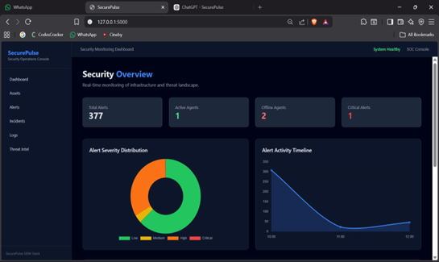
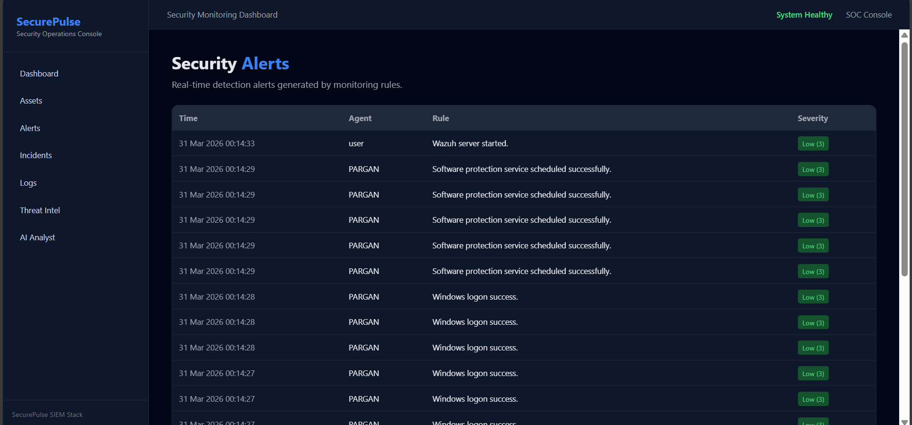
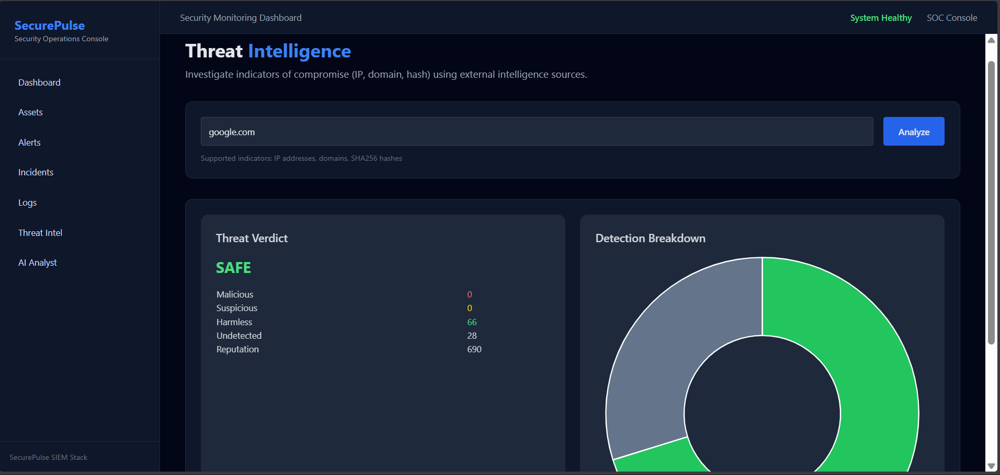
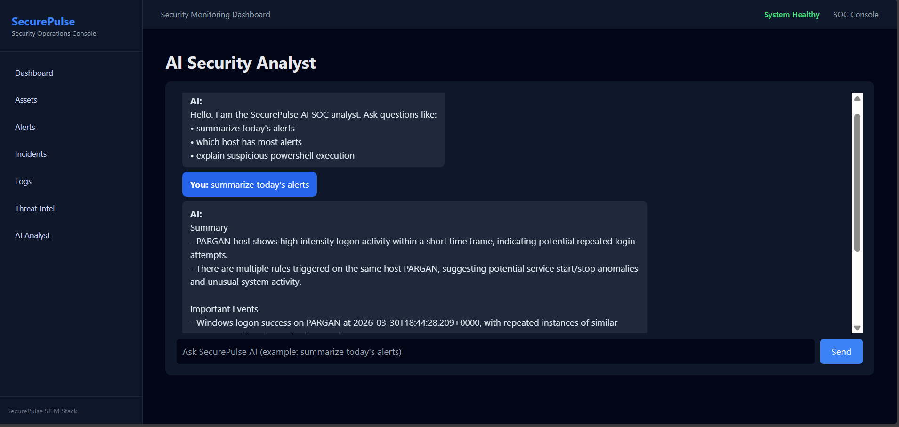

#  SecurePulse-SIEM

A real-time Security Information and Event Management (SIEM) system built using Wazuh and Flask for monitoring, detecting, and analyzing security threats.

---

##  Features

-  Real-time log monitoring using Wazuh  
-  Alert detection and visualization  
-  AI-powered alert analysis  
-  Interactive dashboard  
-  Secure configuration using environment variables  

---

##  Architecture

```
Wazuh Agent
     ↓
Wazuh Manager (API)
     ↓
Elasticsearch (Indexer)
     ↓
Flask Backend (Services Layer)
     ↓
Web Dashboard (UI)
```
---

##  Tech Stack

<p>      </p>

---
## ⚙️ Setup Instructions

### 1️⃣ Clone the Repository
```
git clone https://github.com/nithin1833-a11y/SecurePulse-SIEM.git
cd SecurePulse-SIEM
```
### 2️⃣ Create Virtual Environment
```
python -m venv venv
```
### 3️⃣ Activate Virtual Environment
#### Windows:
```
venv\Scripts\activate
```
#### Linux/Mac:
```
source venv/bin/activate
```
### 4️⃣ Install Dependencies
```
pip install -r requirements.txt
```
### 5️⃣ Configure Environment Variables
#### Create a .env file in the root directory:
```
GROQ_API_KEY=your_groq_api_key
VT_API_KEY=your_virustotal_api_key

HOST_IP=your_ip (ubuntu server_ip)

MANAGER_PORT=55000
INDEXER_PORT=9200

MANAGER_USER=your_user
MANAGER_PASS=your_password

INDEXER_USER=your_user
INDEXER_PASS=your_password
```
### 6️⃣ Run the Application
```
python app.py
```
### 7️⃣ Open in Browser
```
http://localhost:5000
```
---
##  Wazuh Setup (Required)

This project requires a running Wazuh environment.

### Requirements:
- Wazuh Manager (API enabled)
- Wazuh Agent (installed on monitored system)
- Elasticsearch / Wazuh Indexer

### Steps:

1. Install Wazuh Manager and Dashboard  
   👉 https://documentation.wazuh.com/current/installation-guide/

2. Ensure Wazuh API is accessible:
```
https://<WAZUH_SERVER_IP>:55000
```
3. Install and connect a Wazuh Agent to the manager
4. Verify alerts are being generated in Wazuh Dashboard
5. Update .env file with your Wazuh server details:
```
MANAGER_USER=your_user
MANAGER_PASS=your_password

INDEXER_USER=your_user
INDEXER_PASS=your_password
```
---
##  Screenshots

### Dashboard


### Alerts


### Threat Intelligence


### AI Analysis


---
## Author

Nithin Santhosh
Cybersecurity Developer | SIEM & Threat Detection

---

## Support 

If you found this project useful, consider giving it a ⭐ on GitHub!
